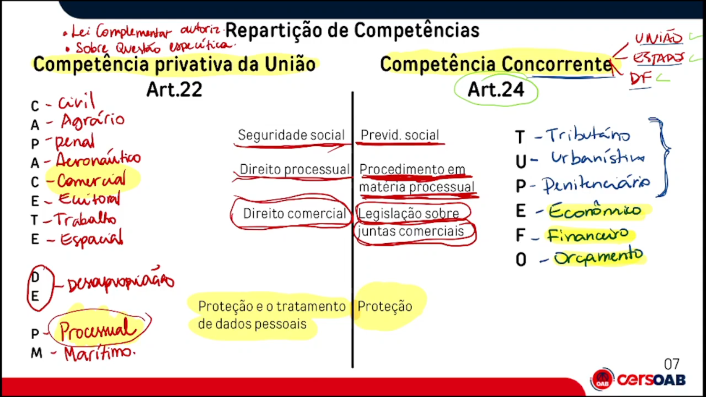
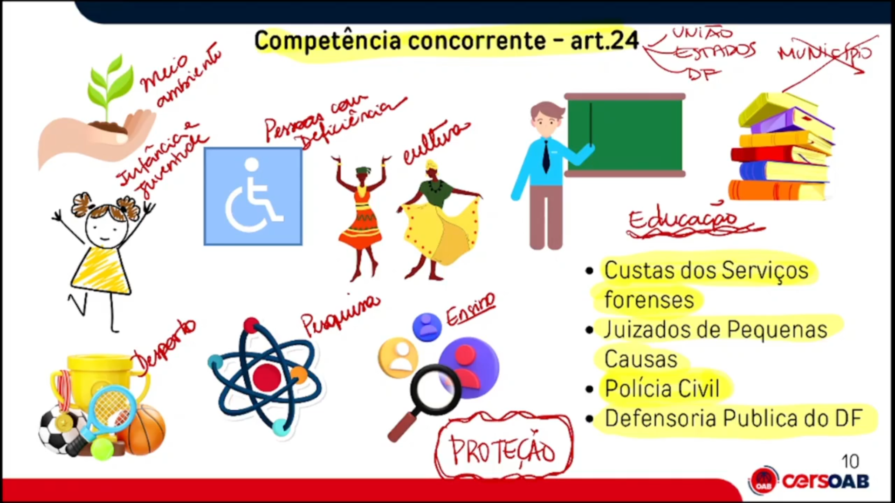

# Organização do Estado
## Competência privativa da União 
```
Para que exista delegação de estados ou município sobre uma competência privativa da união é preciso existe uma lei complementar especificando essa delegação, que a lei a do estado trate de algo especifico daquela matéria em questão.
EX: Direito do Trabalho: mediante uma lei completar pode da o poder do estado legislar sobre o piso salarial de uma determinada categoria.
```



