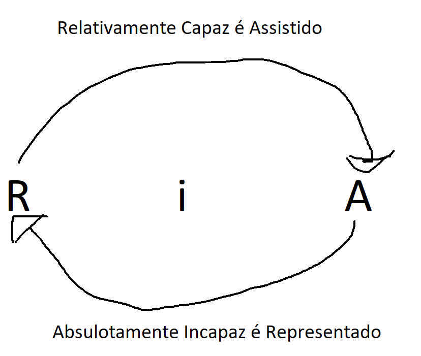

# Partes e Procuradores
```
O incapacitado pode ser parte, mas preciso de uma representação para ser parte, ou seja, tem capacidade de ser parte, mas precisa de representação! O Relativamente Capaz eles não precisam ser representados, mas deve ser assistido.  
Capacidade de ser parte toda individuo de pessoalidade tem, porem capacidade processual o incapaz precisa de representação e o relativamente capaz precisa ser assistido. 
```
* Autor x Réu (Processo Civil) 
* Reclamante x Reclamado (Processo do Trabalho) 


### Explicando o RIA
#### Parece confuso mais relaxa
> O "R" de inicio é Relativamente Capaz
> O "R" de final é Representado
> O "i" de Incapaz
> O "A" de inicio é Absolutamente
> O "A" de final é Assistido




```
 Ao observar imagem primeira serta do "RIA" o R vai para A o Relativamente incapaz é Assistido, depois o A vai para R ou seja o Absolutamente incapaz é Representado. viva a ideia.
```

